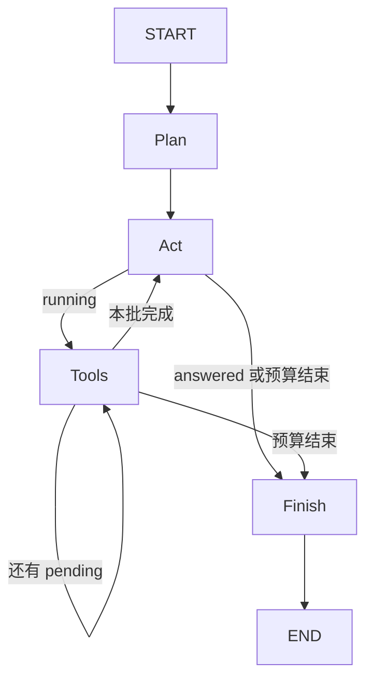

# V2 源码课：显式状态图与跨进程恢复

前置：[V1](V1.md)。后续：[V3](V3.md)。目标：能解释任务退出后究竟保存了什么、从哪里继续。

## 1. 从循环到图的真实原因

V1 把阶段藏在 Python 调用栈和局部变量里。进程结束，messages 和待执行工具一起消失。
V2 将阶段拆成 Plan、Act、Tools、Finish，让框架在节点间保存状态。
图不是为了看起来复杂：它提供显式路由、checkpoint 和可控暂停。
这仍是单 Agent，不是多个节点对应多个 Agent。

## 2. 先学五个概念

| 概念 | 具体对象 | 不是 |
|---|---|---|
| State | 当前 messages、计划、计数、待执行工具 | 只是一段 prompt |
| Context | 本轮从 messages 选出的输入 | 数据库里的全部状态 |
| Thread | configurable.thread_id 标识一个任务 | OS 线程或 worker 数 |
| Checkpoint | 框架记录的状态与执行进度 | 自动可靠执行过所有外部副作用的证明 |
| Resume | 从待执行节点继续 | 重新发送同一个任务文本 |

SQLite 是本地数据库文件，负责持久化。LangGraph 决定保存/读取时机，SqliteSaver 提供后端。

## 3. 阅读地图

1. [v2/agent.py](../../v2/agent.py)：先 `State`，再 `initial`，再 `build`，最后每个节点。
2. [v2/cli.py](../../v2/cli.py)：数据库路径、thread_id、恢复前条件。
3. [v1/model.py](../../v1/model.py)：继续复用模型接口。
4. [tests/test_v2.py](../../tests/test_v2.py)：关闭数据库再打开的测试。
5. [scripts/validate_state.py](../../scripts/validate_state.py)：真正两个进程的验收。

不要先钻进 LangGraph 源码。先把本项目的节点输入输出写清楚，遇到 reducer 再查对应概念。

## 4. State 字段逐个看

| 字段 | 作用 | 更新者 |
|---|---|---|
| messages | 完整对话历史 | initial、Act、Tools |
| task/root | 原任务与目录身份 | initial |
| plan | 简短计划文本，最多 4000 字符 | Plan |
| steps | 已完成模型请求数，包含 Plan | Plan/Act |
| calls | 已执行工具次数 | Tools |
| tokens | 使用量累计 | Plan/Act |
| max_steps/max_calls/max_tokens | 预算 | initial |
| pending | 本轮模型要求的工具列表 | Act |
| cursor | pending 中下一个工具位置 | Act 重置、Tools 递增 |
| status | running/answered/budget_exhausted | Act/Tools |

`TypedDict(total=False)` 描述可选键的形状，不会自动强制所有键都有正确类型。
真正初始化必须由 initial() 填齐节点需要的字段。

### reducer 是什么

`messages: Annotated[list[BaseMessage], add_messages]` 指定特殊合并方式。
节点返回 `{"messages": [answer]}` 并不是替换全部历史，而是由 add_messages 合并到已有列表。
不同消息 ID 通常追加，相同 ID 可更新已有消息。其它字段未指定 reducer，通常由新值覆盖。
所以节点返回值是状态增量，而不是必须包含所有字段的新 State。

## 5. build() 是控制流地图



`add_node` 注册函数，`add_edge` 是无条件边，`add_conditional_edges` 用函数返回下一节点名。
`compile(checkpointer=saver)` 才得到可运行图；`graph.invoke` 执行到结束或中断。
`recursion_limit` 是框架图步数上限，和 max_steps 模型预算不是同一单位。

## 6. 逐节点解析

### Plan

用无工具的模型调用要求最多三步计划。不包含检索得到的事实，只基于 task。
计划是普通输出，不能假设它一定正确。一次 Plan 也会增加 steps 和 tokens。
`planning=False` 时返回空 plan，不产生这次模型调用。

### Act

先检查 budget，再用 V1 context() 生成输入视图。
把 SYSTEM 与当前 plan 组成新的 SystemMessage，仅影响本次请求，不覆盖 State 中的原始消息。
模型返回后，增量追加 answer；设置 pending、cursor=0；有工具则 running，无工具则 answered。

### Tools

每次节点执行只处理 pending[cursor] 一个调用，完成后 cursor 加一。
这是刻意设计：若模型批量要求三个工具，节点之间仍能保存进度，而不是整个批次只有一个恢复边界。
工具结果按 tool_call_id 追加。路由发现 cursor 未到列表末尾，就继续 Tools。

### Finish

只发终止事件、返回空增量，不再调用模型。日志里包含步骤、工具次数和 tokens。
预算耗尽是明确状态，不应伪装成模型任务成功。

## 7. 手算批量工具与预算

假设 planning=False、max_calls=1，模型一次请求 read_file(A)、read_file(B)。

| 时点 | steps | calls | cursor | 状态 |
|---|---:|---:|---:|---|
| initial | 0 | 0 | 0 | running |
| Act 后 | 1 | 0 | 0 | running |
| 第一次 Tools 后 | 1 | 1 | 1 | running |
| 第二次 Tools 入口 | 1 | 1 | 1 | budget_exhausted |

B 没有执行，进入 Finish。messages 中会有未完成批次，所以不能直接把它当完整新对话再次喂给模型。
当前终端让预算耗尽任务开新会话，而非随意绕开预算。

max_tokens 是软预算：收到一次响应后才知道 usage，本次响应可能已经超出上限。
提供商没有 usage 时累计无法可靠反映实际成本。max_calls 是工具节点逐次检查的硬次数上限。

## 8. SQLite 与 CLI 恢复

CLI 使用目标目录 `.forgecode/state.sqlite`。
调用参数形如：

```python
options = {"configurable": {"thread_id": "demo"}, "recursion_limit": 1000}
```

新任务使用 initial 数据；恢复任务传 `None` 给 invoke，并使用相同 thread_id。
为什么不是再次传 initial？因为那会把新输入混进已有状态，不能表达“从原待执行位置继续”。
CLI 先 get_state：线程不存在、root 不匹配、线程已结束等情况都会拒绝不合理恢复。

```bash
python -m v2.cli --config config.local.json --repo /path/to/repo \
  --thread lesson --pause-after-tool '阅读相关文件并修复测试失败'
python -m v2.cli --config config.local.json --repo /path/to/repo \
  --thread lesson --resume
```

`--pause-after-tool` 是静态中断：工具已执行，下一步前暂停。
V4 的审批用动态 interrupt：在危险操作之前暂停。两者的时机和意义不同。
V2 的普通命令确认仍是 CLI input 回调，不是持久化的 LangGraph 审批请求。

## 9. 崩溃恢复的诚实边界

外部文件写入与 SQLite checkpoint 不处于一个共同事务中。
如果工具写完文件，checkpoint 尚未写入时进程死亡，恢复可能重复运行该节点。
精确替换第二次可能报匹配失败，模型可以观察；发请求/付款等非幂等操作则可能产生重复后果。
本项目不保证 exactly-once，单 thread 也没有跨进程并发锁。

“可恢复”应表述为：从最近成功持久化的图状态继续，减少从头开始的成本。
不能表述为：任意时点断电后都绝不重复任何操作。

## 10. 实验与测试证据

```bash
python -m unittest discover -s tests -p 'test_v2.py' -v
python scripts/validate_state.py
```

第一条无真实 API。阅读三个用例：

- `test_reopen_database_and_resume_without_repeating_tool`：正常工具后暂停，关闭连接再开，工具只执行一次。
- `test_plan_consumes_budget`：max_steps=1 时 Plan 用完预算，Act 不再调用模型。
- `test_batched_calls_respect_budget`：批量工具不能绕过 max_calls。

第二条使用 Windows 配置与真实模型，子进程一完成首次工具后退出，子进程二恢复；验收器独立测试结果。
已记录真实验证 calls=1 暂停，恢复完成 calls=6。具体新运行次数可不同，不是固定预期。

练习：画出一次暂停时 pending 与 cursor 的值，并解释为什么下一步是 Tools 而不是 Act。
练习：将 planning 关闭，预测最大允许 Act 调用次数如何变化。

## 11. 面试追问

**为什么不用自己把 messages 写 JSON？** 能做，但还要保存待执行节点、pending 工具位置、状态合并语义；LangGraph 统一这些执行状态。

**图是不是比循环更聪明？** 不是。它改善控制与可观察性，模型质量仍取决于模型、工具、上下文及任务。

**Checkpoint 是否就是长期记忆？** 不是，它保存任务执行快照；跨任务的可检索经验在 V3 单独实现。

**恢复时能换模型吗？** CLI 可以加载新的模型配置继续，但状态与预算保持；改变模型可能影响后续行为，不是确定性重放。

**一个 Tools 节点为什么不执行所有工具？** 小节点提供更细恢复边界与预算检查点；代价是更多图调度和 checkpoint 写入。

**如果节点开始前预算刚好耗尽？** Act/Tools 各自检查并转入 Finish；token 只在请求后可知，所以不是精确计费限额。

## 12. 自测

能写出状态增量、解释 add_messages、手画条件路由，才算理解图。
能区分普通进程退出恢复与副作用后崩溃重放窗口，才算理解持久化边界。
下一版问题不是状态存得不够多，而是模型如何从大仓库选择少量有用信息。
