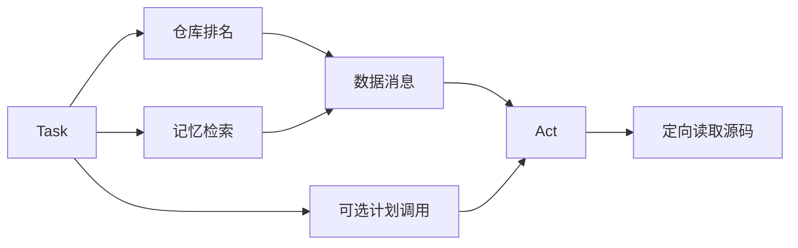

# V3 源码课：仓库检索、上下文排序与长期记忆

前置：[V2](V2.md)。后续：[V4](V4.md)。目标：解释为什么“索引过文件”与“把文件读进模型上下文”是两件事。

## 1. 本版解决的限制

V2 可以长时间执行，却仍可能盲目列文件、搜索和读取。
V3 提供任务相关的仓库大纲，模型再定向读取；同时保存带来源的经验，供新任务检索。
没有 embedding、向量数据库、Tree-sitter 或多 Agent。计划中列出的候选技术不等于实际已实现技术。

## 2. 阅读地图

| 文件 | 先看函数 | 问题 |
|---|---|---|
| [repository.py](../../v3/repository.py) | paths、index、select、symbols | 文件从哪里来，如何排名？ |
| [memory.py](../../v3/memory.py) | remember、recall | 笔记保存什么，怎样检索？ |
| [tools.py](../../v3/tools.py) | Tools.__init__、repo_map、remember | 新能力如何暴露给模型？ |
| [agent.py](../../v3/agent.py) | Runtime.plan | 开始执行前如何注入线索？ |
| [cli.py](../../v3/cli.py) | main | 为什么如此短？ |
| [test_v3.py](../../tests/test_v3.py) | 两个 RepositoryTest | 排名、预算、来源、持久化 |

CLI 只是给 V2 的 main 注入新版 Runtime/Tools。理解依赖注入后，不必复制整个 CLI 才算“新版本”。

## 3. AST 与词法检索基础

AST（抽象语法树）把 Python 文本解析成 FunctionDef、ClassDef、Import 等结构。
它不是执行代码，也不是理解全部业务语义；这里仅提取名字、行号、种类和 import 字符串。
语法错误时仍保留文件的词法/路径信息，不因一个文件无法解析就放弃全部索引。

词法检索按实际字符或词匹配；语义检索试图找意思相近的内容。
编码任务常有函数名、错误信息、路径等强信号，因此先用词法和结构能保持可解释。
当前 terms() 的正则偏英文标识符，中文任务若没有英文符号，自动排名可能为空。
`invoice_total` 会被拆成 invoice 与 total；这里没有中文分词和通用驼峰拆分逻辑。

## 4. paths()：哪些文件有资格进入索引

Git 命令 `ls-files -co --exclude-standard -z` 获取跟踪文件及未被忽略的未跟踪文件。
`-z` 用零字节分隔，避免带空格文件名被简单分词破坏。
去重排序后，每个路径再次用 V0 的 guard.path 校验，并过滤文件大小与符号链接。
Git 返回失败时回退到 V0 的 os.walk；可执行文件 git 缺失则不是这条回退语义的等价情况。

注意：Git 已跟踪的文件仍可能出现在清单中，即使之后加入 gitignore；gitignore 不是密钥审计工具。
现有 `.gitignore` 还应排除 `.forgecode` 等运行数据，避免索引/提交内部内容。

## 5. index()：构建本地记录

最多处理 5000 个可读文本文件，每个不超过 500 KB。
对每个文件生成：

```text
path: invoice.py
symbols: [{name: invoice_total, line: 1, kind: FunctionDef}]
imports: [...]
lines: 行数
terms: 源码词集合
```

`ast.walk` 遍历整棵树，因此会看到嵌套函数和类成员，但没有完整限定名、跨文件调用图或语义类型信息。
index() 当前每次重新扫描，没有增量索引缓存；大仓库中这可能成为本地开销。
不要把提取 import 字符串称为“已经构建完整依赖图”。

## 6. select()：排名与预算

令 Q 为任务词集合。评分为：

```text
5 × |Q ∩ 路径词|
+ 4 × |Q ∩ 符号名词|
+ 1 × |Q ∩ 源码词|
```

路径与符号权重大于正文，防止普通内容词完全主导排名。
权重是人工启发式，不是训练得到的模型参数，也未单独调参证明最优。
按分数降序，文件名作为稳定的同分排序；只考虑前 8 条。
去掉大 terms 集合后，逐条计算 JSON 字符数，累计不超过 8000 字符。
如果某条太大跳过，不会继续从第 9 个以后的候选补位。

返回 selected 是符号/导入大纲，不是完整源码。模型需要调用 read_file 才能看到实现细节。
estimated_tokens≈字符数/4，只是粗估；JSON 外壳和其它 prompt 内容不在该局部预算里。

手算：任务词有 invoice、total，一个文件路径含 invoice、函数名含 invoice 和 total，正文也含两词，
则示例得分为 5×1 + 4×2 + 1×2 = 15。检索命中不代表它一定就是 bug 根因。

## 7. memory.py：把笔记和执行快照分开

SQLite 表字段是 id、kind、note、sources、created、confidence。
kind 只能 semantic 或 episodic：前者是项目结构/约定，后者是某次任务经验。
note 最多 2000 字符，必须提供 1–10 个真实来源文件；sources 存路径到 SHA-256 的映射。

SHA-256 是文件内容指纹。它可以帮助检查来源是否变化，不能证明笔记内容一定正确。
remember 只存来源摘要，不把整份源码复制进数据库。
V3 的 remember 工具默认 confidence=.5，这不是 LLM 预测正确率。

recall 读取最近 500 条，按 query 与 note/路径词交集评分，过滤零分，最多返回 5 条。
这是结构化笔记上的简单词法排序，不是向量相似度。
V3 尚未调用源指纹做失效过滤，因此 stale memory 仍可能出现；V4 才实施这一限制。

| 操作 | 回答的问题 | 信息权威性 |
|---|---|---|
| Repository.select/search | 当前源码什么地方相关？ | 源码是当前事实来源 |
| Memory.recall | 以前留下什么经验？ | 笔记可能有误或过期 |
| Checkpoint resume | 上次任务执行到哪？ | 保存控制流，不评估知识真伪 |

## 8. 工具与 Runtime 怎么组合

V3 Tools 继承 V1，加入 repo_map、find_symbols、recall_memory、remember。
`files()` 改用 Repository.paths，因此基础搜索/目录工具也能受益于 Git 文件清单。
Runtime.plan 先生成 hints 并发出 retrieval/memory 事件，再调用父类 Plan。
最后把 hints 作为 HumanMessage 增量加入状态，注明它们是数据而非指令。

重要细节：当前额外 Plan 模型调用只看原任务，不看刚检索的 hints；后面的 Act 才看到它们。
即使 planning=False，V3 的检索与 hints 注入仍执行。关闭计划不等于关闭检索。
这是理解 V5 各开关独立性的关键。



## 9. 指标要避免偷换口径

indexed_files 是本地索引读取的文件数；files_read 是模型主动调用 read_file 的不同路径数。
index 确实读了源码，因此不能宣传“系统完全只读取两个文件”。
正确表述是：本地扫描 102 个文件，送入自动大纲的是 2 个相关文件，模型主动读了 2 个源文件。
input_tokens 包含所有模型输入，不只 repository hints；累计 token 还会重复计算多轮历史。

## 10. 实验与预期

```bash
python -m unittest discover -s tests -p 'test_v3.py' -v
python -c "from v3.repository import Repository; print(Repository('.').symbols('context'))"
python -c "from v3.repository import Repository; print(Repository('.').select('context messages budget'))"
python scripts/validate_repository.py
```

前 3 条无需模型；最后一条使用 Windows 测试配置调用真实模型。
真实验收生成 100 个干扰模块加 2 个目标文件，检查模型读取少于 10 个文件、测试通过、测试文件未改动、记忆可重新打开读取。
既有记录为读取 2 个文件、6 次工具调用、17234 total tokens；新运行不保证相同。
这是生成的教学仓库，不是复杂生产仓库实证。

练习一：用纯中文 query 和带英文函数名 query 比较 selected，解释差异来自哪一行分词。
练习二：临时修改记忆来源后调用 V3 recall，观察仍能命中，推导下一版为何要校验指纹。
练习三：把 budget 改为很小的值，观察 selected 缩小但 indexed_files 不一定减少。

## 11. 面试问答

**为什么不用向量数据库？** 当前任务可借助精确符号和路径解决，先保留简单、可解释、低基础设施成本的方案，效果由评测判断。

**你的 AST 支持哪些语言？** 只有 Python；其它文本文件走词法。没有假装使用 Tree-sitter 支持所有语言。

**自动上下文是否保证找到根因？** 不保证，排名只给候选，模型仍需要搜索和读源码证实。

**怎么区分索引成本与模型成本？** 单独记录扫描文件与模型文件读取；token 使用提供商 usage，而不是把局部估算当实际费用。

**记忆会不会污染模型？** 会。模型可能写错结论、源码可能更新；后续靠来源指纹和期限筛选，但不能证明结论正确。

**未来怎么改进？** 先找失败样例；可能需要中文/标识符分词、增量缓存、限定符号名、导入关系或混合检索，再用消融验证。

## 12. 自测

能手算 select 得分、指出 token 估算的范围、解释 Plan 与 hints 的实际先后关系。
能说明 semantic/episodic 是笔记类型而不是两个不同模型。
下一版要解决“找到了代码并修改”之后，如何隔离、授权与给出可信完成证据。
