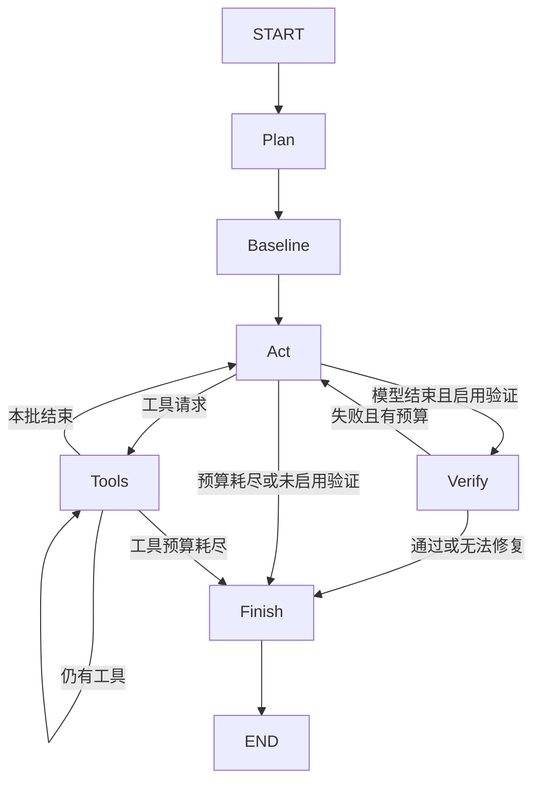

# V4 源码课：工作区隔离、审批与验证修复循环

前置：[V3](V3.md)。后续：[V5](V5.md)。目标：能够用代码和失败轨迹证明“完成”由运行时检查，而不只由模型宣布。

## 1. 三个独立问题

1. 修改不应混入用户正在工作的目录：worktree。
2. 外部命令具有风险，必须明确授权：interrupt/resume。
3. 模型自述成功不是代码证据：基线、最终验证和失败修复。

三者不能互相替代。审批不是沙箱；隔离工作区不保证修复正确；测试通过也不等于命令无风险。

## 2. 阅读顺序

| 文件 | 先看哪里 | 对应问题 |
|---|---|---|
| [workspace.py](../../v4/workspace.py) | Workspace.create/load/export | 在什么目录工作，修改如何交付 |
| [agent.py](../../v4/agent.py) | build、route_act、verify | 谁决定完成，失败去哪里 |
| 同上 | tools_node | 为什么审批可以跨进程恢复 |
| [cli.py](../../v4/cli.py) | invoke 循环和 Command(resume=...) | UI 如何回应图的中断 |
| [memory.py](../../v4/memory.py) | recall | 如何筛除来源变化的笔记 |
| [tests/test_v4.py](../../tests/test_v4.py) | ReliableTest | 哪些失败路径已有可执行证据 |

V4 Runtime 继承 V3，V3 继承 V2。未重写的 act/budget 等方法仍从父类获得。
这是一套行为逐步扩展的系统；读方法时先看是否在当前类定义，再沿父类寻找。

## 3. Git 基础只需掌握这些

HEAD 指向当前提交；工作目录是磁盘上的文件；未提交 diff 不在 HEAD 中。
worktree 是同一个 Git 仓库的另一个工作目录，可以 checkout 不同提交。
本项目使用 `git worktree add --detach PATH HEAD`，创建 detached HEAD 工作树，不自动创建业务分支。
多个 worktree 共享 Git 元数据，因此隔离的是文件工作区，不是完整安全边界。

## 4. Workspace.create 逐步解析

构造 Workspace 时确认 `--repo` 是 Git 根目录，并校验 thread 名称。
create 检查已有 manifest/path，防止覆盖别的任务。
检查工作目录干净，是因为新 worktree 从 HEAD 创建；如果不拒绝脏目录，用户未提交代码会静默缺失。
`.forgecode` 被排除在这个脏目录判断之外，它属于运行数据。

保存 metadata：root、worktree、head、verify。
metadata 是任务与工作区关系，不是 LangGraph checkpoint；两者有不同职责。
`load()` 恢复时检查路径与 Git 根目录吻合，但不应宣称它对所有外部篡改都有完整验证。
数据库状态放在原仓库 `.forgecode/state-v4.sqlite`，工作文件位于 worktrees 子目录。

## 5. 补丁交付如何处理

export 先取相对 HEAD 的 binary diff，禁止 external diff/textconv，避免扩展过滤器改变输出或执行额外处理。
再枚举 untracked 文件，对允许的新文件用 `git diff --no-index /dev/null FILE` 生成补丁。
只看普通 git diff 不会包含所有新文件，这是需要额外处理的原因。
补丁文本不能随意 strip，否则末尾空行或空白可能丢失，影响 apply。

结果存入 `.forgecode/tasks/<thread>.patch`。原目录不自动应用、不自动 commit/push。
验证 patch 可应用用 `git apply --check`；这不证明业务正确，只说明补丁与目标内容相容。
符号链接与内部文件可能被过滤，不能把导出描述成对所有文件类型的完整快照。

## 6. 图与新增状态



State 新增 verify_argv、baseline、verification、repairs、max_repairs、verification_enabled。
verify_argv 是用户指定的可信命令；baseline 保存修改前结果；verification 保存最近最终验收结果。
repairs 统计运行时发起的修复轮，不是 edit_file 总次数。

## 7. 基线、最终验证与完成语义

Baseline 在模型执行修改前运行，让模型知道现有失败是什么。
它失败不直接结束任务，因为修复 bug 的初始状态本来可能失败。
Baseline 的结果以 HumanMessage 注入，让后续 Act 能看到真实输出。

route_act 不把 answered 直接当最终成功，而是路由到 Verify。
Verify 执行相同 verify_argv：退出码 0 且没有超时才设 verified。
失败时检查 repairs 和 budget；可继续则追加明确的失败证据、repairs+1、status=running，回到 Act。
否则设 verification_failed，停止。

`verification_enabled=False` 用于交互无验证模式和 V5 消融，此时 answered 不升级成 verified。
max_tokens/steps 限制模型请求，不是给所有 baseline/verify 子进程计数；这些运行有独立 30 秒超时。
验证脚本如果没有发现任何测试也可能退出零，当前运行时没有统一解析测试数量来拒绝它。

## 8. 动态审批 interrupt 的正确理解

tools_node 取出当前 call，若 name 为 run_command，先执行 `interrupt(request)`。
第一次到此处时图挂起，返回待审批内容，checkpoint 保存继续执行所需信息。
CLI 收集 snapshot.tasks 中的 interrupts，显示 argv/cwd，收到用户输入后传 `Command(resume=True/False)`。

关键：恢复时通常从被中断节点开头重新进入，并由框架把 resume 值交回对应 interrupt。
因此需要把危险副作用放在 interrupt 后面，不能先执行命令再询问是否批准。
中断前的语句可能重跑，也不宜在此前添加非幂等的外部动作。

批准后临时替换 tools.approve，让它只允许当前 argv，finally 恢复原回调。
拒绝则构造 ToolMessage(error=denied)，推进 cursor/calls；模型仍能根据拒绝决定下一步。
拒绝并不等于假装没有工具调用，否则消息协议会缺少结果。

CLI 把 checkpoint 审批与终端 input 分开，终端退出不会丢失已持久化审批请求。
但节点副作用与 checkpoint 提交仍不是原子事务，V2 的重放窗口依旧存在。

## 9. 记忆新鲜度

V4 Memory 继承 V3 存储，但可以从原仓库存储、用 worktree 当前文件校验。
recall 会筛除超过 30 天、confidence < .4、来源缺失或内容哈希变化的笔记。
默认 semantic .5、验证成功任务 .8 是人工设定标签，不是统计校准置信概率。
记忆没有被自动删除，只是不返回；源码回到相同内容时，在期限内也可能再次通过校验。

finish 在 verified 时为已跟踪的改动文件保存 episodic 笔记，然后发布 diff 事件。
自动笔记主要是任务摘要加来源，不是详尽的根因/尝试分析报告；新 untracked 文件不一定进入自动 sources。
工作区内写对了、主仓库尚未应用的笔记，在主仓库对应旧源码上可能失效，这是来源绑定的合理结果。

## 10. 一个失败再修复的具体状态变化

假设 add 应返回 a+b，初始返回 a-b。

| 阶段 | 实际动作 | 状态结果 |
|---|---|---|
| Baseline | unittest 执行 | exit=1，继续 Act |
| 第一次修改 | a-b -> a*b | 模型宣布结束 |
| Verify | unittest 执行 | exit=1，repairs=1，回到 Act |
| 第二次修改 | a*b -> a+b | 进入命令审批 |
| Approval | 用户批准指定测试命令 | 执行并回传 |
| Verify | unittest 再执行 | exit=0，verified |
| Finish | diff、记忆、终止事件 | 保留 worktree 和 patch |

这个用例来自确定性 Script 模型，实际文件修改与测试都发生。
它验证控制流，而不是证明真实 LLM 必然先犯该错误再正确修复。

## 11. 测试与实际操作

```bash
python -m unittest discover -s tests -p 'test_v4.py' -v
python scripts/validate_reliable.py
```

第一条包括审批拒绝不执行、审批后重开数据库恢复、失败再修复、主目录不变、新文件补丁、stale memory。
第二条使用真实模型与临时 worktree，脚本只预批准指定 unittest 命令，独立检查测试未改动和补丁可应用。
脚本内自动审批是验收夹具策略，不等于日常 CLI 会自动批准一切。

实验一：在临时仓库制造未提交文件，Workspace.create 应拒绝，而不是悄悄忽略。
实验二：审批前中断，检查主文件没有因该命令/编辑被修改，恢复后再批准。
实验三：把 max_repairs=0，最终验证失败应直接 verification_failed。
实验四：新增带尾部空格的文件，导出后 `git apply --check` 应成功。

## 12. 交互终端是另一层适配

[forgecode/session.py](../../forgecode/session.py) 的 InteractiveRuntime 额外审批 edit_file，因为 `forge` 直接操作当前目录。
原 V4 单次隔离模式中 edit_file 默认执行，外部命令才 interrupt。
Session.turn 用相同 thread_id 合并多轮消息，新轮重置预算，恢复轮传 None/Command。
菜单和历史浏览则在 interactive.py、menus.py、history.py，学 V4 核心不必先读这些显示代码。

## 13. 面试追问

**worktree 与容器的区别？** 前者隔离工作目录并共享 Git 信息；后者可提供进程/文件系统资源隔离，但本项目没有容器沙箱。

**审批为何不用简单 input 放在工具里？** input 绑定当前进程，interrupt 把待审批状态交给持久化运行时，可在重启后继续。

**验证为什么放独立节点？** 模型无工具回复只触发运行时检查，不能直接自授 verified；失败反馈有明确路由。

**测试被模型改成永远通过怎么办？** V4 本身不全面防止该问题；真实验收和 V5 额外检查测试文件，并用独立用例验证。

**能保证 exactly-once 吗？** 不能，外部副作用与 checkpoint 有提交窗口。应对更高风险操作增加幂等键/事务性工具，但此项目未实现。

**为什么读取记忆还要校验源码？** 过去正确的信息可能因源码变化过时，哈希能发现来源变化，但不能证明未变化的笔记结论正确。

## 14. 自测与过渡

能指出 interrupt 前后哪一步有副作用；能解释 answered、verified、verification_failed 的不同。
能展示一份主目录未变但 worktree 有 diff 的证据；能说明验证范围的不足。
到此功能已足够演示，下一版应评估，而不是继续堆更多框架。
