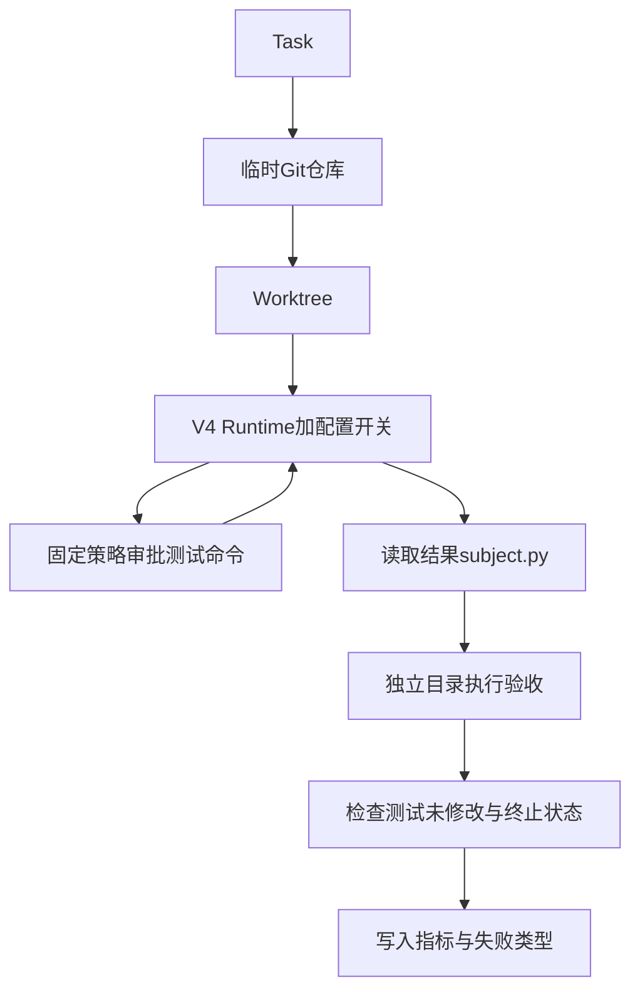

# V5 源码课：独立验收、指标与消融实验

前置：[V4](V4.md)。本课目标：不只会运行基准，还能判断一个“100% 成功率”的结论到底支持什么。

## 1. V5 不增加新的 Agent 推理算法

`v5/cli.py` 复用 V4 main。新增内容是任务、独立验收器、批量运行、指标汇总和报告。
这体现“完成可运行系统后，验证架构是否有价值”，而不是用新增技术数量衡量项目质量。

## 2. 文件地图

| 文件 | 关键内容 | 先问的问题 |
|---|---|---|
| [tasks.py](../../v5/tasks.py) | Task、TASKS、PAIRED_IDS | 初始代码、任务要求和正确标准是什么？ |
| [oracle.py](../../v5/oracle.py) | test_source、evaluate_source | 谁在判断成功？ |
| [evaluate.py](../../v5/evaluate.py) | create_fixture、run_one | Agent 与验收数据怎样隔开？ |
| 同上 | summarize | 分母、配对和聚合是否正确？ |
| 同上 | main | 如何复现、断点续跑、控制并发？ |
| [report.py](../../v5/report.py) | main | 报告如何生成，如何记录修正实验？ |
| [test_v5.py](../../tests/test_v5.py) | EvaluationTest | 验收器自身是否可靠？ |

## 3. 评测基础术语

Benchmark 是一组带评判标准的任务，不只是几个聊天提示词。
Oracle 是本项目的验收程序，不是数据库产品或另一个 LLM 裁判。
Ablation（消融）是关闭一个机制，尽量保持其它条件不变，检验它带来的差异。
Paired comparison（配对比较）要求同一个任务、同一次重复对应比较，避免任务难度不同造成偏差。
Baseline 在本课可指完整配置比较基准；不要与 V4 的修改前测试节点混淆。

## 4. Task 数据结构

Task 使用 frozen dataclass，字段是 id、category、instruction、source、solution、cases、constraint。
source 是错误/未实现/待重构的初始代码；solution 是本地参考实现，只用于验证用例和函数名等。
cases 是输入与期望值的元组，部分期望为 `{"raises":"ValueError"}`。
constraint 支持 no_mutation、no_loops、join 等结构/行为约束。

20 个任务包含 12 个 bug、6 个 feature、2 个 refactor。
每项通常是一份 subject.py 中的一个函数，加公开测试和 24 个干扰模块。
这不是 SWE-bench，也不是多文件大型工程维护的代表性采样。
“20 项”满足的是小型教学评测规模，不能据此说覆盖所有编码工作类型。

## 5. create_fixture 与信息隔离

每次运行创建全新临时 Git 仓库，写初始 subject.py、test_public.py 和干扰模块。
公开测试只取任务第一个 case，完整隐藏验收用例不会写入 Agent 的 worktree。
提交初始状态后，再创建 V4 worktree。不同任务/配置的代码改动互不复用。

所有 memory 开启组预置同样的仓库约定笔记：实现路径、测试路径、测试命令和任务 ID。
笔记没有参考答案；但它是人工提供的 warm orientation，不是模型在历史任务中自然总结的记忆。
所以这组实验只支持“预先已有仓库线索”的比较，不支持“长期经验学习提升”的结论。

## 6. run_one 的完整流程



预算固定为 max_steps=12、max_calls=30、max_repairs=2。
模型每次请求 run_command 时，只自动批准精确的 `python3 -m unittest discover` 参数列表。
其它命令拒绝，因此这个基准不是任意 shell 自主执行基准。
任务提示在修正后所有配置一致，区别主要来自 runtime/tools 的功能开关。

模型返回后读取 subject.py 交给独立 oracle；如果 test_public.py 被修改，即使验收通过也判任务失败。
若图状态不是 verified/answered，也会判任务失败，避免预算耗尽但偶然写对代码被算完整成功。
异常记录 exception_type，避免日志写入可能包含凭据或 URL 的提供商异常原文。

## 7. Oracle 不是“相信 pytest 退出零”

evaluate_source 把结果源码复制到新的临时目录，写入完整 unittest 用例及 runner。
这避免模型工作区中公开测试修改直接决定最终分数。
运行结果统计 testsRun、failures、errors，要求发现用例数量等于任务预期总数。
因此“没有执行测试但程序退出零”不会在正常实现里被当作全部通过。

no_mutation 用 deepcopy 保存输入，运行后比较原值。
no_loops 检查 AST 中没有 For/While/AsyncFor；join 还要求出现 `.join(...)` 调用。
结构约束是明确但有限的语法检测，不是完整语义等价证明，例如扫描的是整个源码 AST。
source 仍会在宿主机 Python 执行，因此独立目录是验收数据隔离，不是针对恶意代码的安全沙箱。

## 8. 先验证验收器自身

```bash
python -m unittest discover -s tests -p 'test_v5.py' -v
```

测试遍历全部 20 个任务：参考实现必须通过，初始实现必须失败，任务 ID 必须唯一。
重构任务初始代码可能功能正确，但结构不符合要求，仍应验收失败。
这是避免“错误测试导致虚假高分”的第一层检查，不是穷尽所有边界。
增加任务时首先写 reference/source/cases，然后运行这条测试，再花钱调用模型。

## 9. 指标的定义与局限

| 指标 | 计算 | 注意事项 |
|---|---|---|
| task success | success=True 的运行数 / 运行数 | 包括终止与测试篡改约束 |
| test pass | 通过独立 case 数 / 总 case 数 | 和任务成功率不是同一分母 |
| steps | model_start 事件数 | 包含 Plan，异常请求也可能计入 |
| tool_calls | tool_end 事件数 | 包含拒绝的调用结果；不含独立 baseline/final 验证 |
| tokens/input_tokens | usage 事件累计 | usage 缺失不能解释成免费 |
| latency | run_one 从开始到结束的墙钟时间 | 含初始化、API、工具、验收，不是纯模型推理时间 |
| files_read | read_file 请求中的不同 path 数 | 不代表索引器只扫描了这么多文件，也未单独剔除失败读取 |
| verification_runs | verification 事件数 | 强制 baseline/final 次数，模型自发 run_command 不算这里 |
| memory_hits | memory 事件 hits 累计 | 命中不意味着笔记被真正利用或正确 |

假设两个任务分别通过 1/1、9/10 用例，测试通过率是 10/11，不是两者比例的简单平均。
如果第二个任务不满足结构约束，即使 9 个甚至 10 个行为用例通过，也可能 task success=False。

## 10. 四组消融究竟关闭了什么

| 配置 | 变化 | 保留 |
|---|---|---|
| full | 全部开启 | 对照组 |
| no_planning | 不发额外 Plan 模型请求 | 仓库检索、记忆、验证 |
| no_context | 不自动注入仓库排名，不提供 repo_map/find_symbols | 普通 list/search/read、记忆 |
| no_verification | 不强制 baseline/final/repair | 模型仍可主动请求测试工具 |
| no_memory | 不检索或提供记忆工具 | 仓库检索、计划、验证 |

每组选择同样 5 个任务：median、binary_search、balanced、merge_intervals、refactor_sum。
20 full + 4×5 ablation = 40 项，不是每个任务都有 5 种配置。
不应直接拿 full 20 项均值减去某消融 5 项均值；summarize 按 task/repeat 连接形成配对。
差值统一为“消融 - full”，负 token delta 表示关闭后更省 token。

## 11. 实验曾经如何被修正

首轮 no_verification 去掉了任务级测试命令提醒，导致模型请求其它未授权测试命令。
这样同时改变了提示和机制，无法将差异只归因于强制验证。
检查轨迹后保留原始记录，用一致提示重跑 5 项，report 的 replacement-directory 显式替换。
这是实验有效性修正，不应偷偷覆盖失败记录或只挑更好结果。

```bash
forgecode-eval --suite matrix --variant no_verification --windows-env \
  --out .forgecode/corrected-verification
python -m v5.report .forgecode/original-matrix \
  --replacement-directory .forgecode/corrected-verification \
  --output docs/corrected-report.md
```

上面是格式示例，两个目录必须分别来自对应完整实验和修正实验，并且模型、数据集指纹、强度一致。
report 目前不是通用统计分析平台，替换操作需要研究者确认任务和实验约束。

## 12. 重现与断点续跑

```bash
forgecode-eval --suite smoke --config config.local.json --out .forgecode/lesson-smoke
forgecode-eval --suite matrix --config config.local.json --workers 3 --repeats 1 \
  --out .forgecode/lesson-matrix
python -m v5.report .forgecode/lesson-matrix --output docs/lesson-report.md
```

manifest 保存数据集 SHA-256、模型、强度、workers、repeats、suite、seed=42。
结果逐行写 JSONL，重启读取已有 task/variant/repeat 三元组，跳过已完成项。
已失败项也被跳过；有意重试应使用新目录，不能把续跑误当重试失败功能。
seed 固定任务打乱顺序，不会固定远端模型生成。并发完成顺序仍不同。
manifest 不包含所有运行时代码版本或接口指纹；严谨比较还应记下 Git 提交与提供商设置。
不要同时对同一个输出目录启动两个评测进程，当前没有文件级并发协调。

## 13. 本次结果如何讲

完整数据：[报告](../evaluation-v5.md)、[结构化指标](../evaluation-v5.json)。
模型 qwen3.7-flash，默认推理强度；有效比较 40/40 全部通过。
full 20 项平均 15367 tokens、37.95 秒；所有组 files_read 都是 2。
5 对任务中关闭 Plan 平均减少约 814 token、24.76 秒，成功率不变。

合理结论：这些小任务未显示额外计划的成功率收益，观察到额外调用成本。
不合理结论：规划永远无用，或 no_planning 在所有编码任务上更好。
所有组成功率饱和，不能证明检索、记忆、验证有显著质量增益，也不能证明它们没有价值。
只有一次重复和 5 对消融样本，没有置信区间或显著性分析，延迟还受并发与网络影响。

## 14. 失败分类为什么仍保守

当前分类为 infrastructure、termination、verification、verification_tampering、code_or_edit。
源码观察不足导致错误不自动断言为“上下文失败”，计划不好也不自动归因为“规划失败”。
这些因果判断需要人工轨迹复查或更明确的实验标注。
本轮没有实际失败分布，因此不能回答“生产主导失败模式是什么”。
代码支持保存失败，不等于已有统计证据证明某种失败占比。

## 15. 面试问题

**如何避免评测泄漏？** 参考实现和完整 cases 不放进 Agent 工作区，结果复制到独立目录验收；仍不声称对恶意代码有强沙箱保障。

**100% 是否证明系统可靠？** 只能证明该模型该次运行在这些小任务与用例上通过，可能有难度不足和覆盖偏差。

**为什么一定要配对？** 同一任务难度消去一部分混淆，20 对 5 的总体均值不能直接比较机制。

**记忆消融测了什么？** 统一预置的项目说明，不是自然长期任务记忆；下一步需要设计跨任务顺序与污染控制。

**为什么不凭 LLM judge 评分？** 对可执行编码任务，确定性测试更直接；但测试仍需要参考实现、负例和结构约束校验。

**你发现了什么负结果？** 当前简单任务计划增加成本却没有成功率提升，其它机制也未显示质量差异。

**下一步怎么提高实验质量？** 加多文件真实 issue，更多重复，记录代码/模型版本，比较配对分布与区间，人工分析失败原因。

## 16. 最终学习验收

你应能从 Task 一直讲到一行 results.jsonl，指出每个指标来自哪个事件。
能在看表前先检查样本数、任务集合、对照变量和验证器。
能写一段不过度宣传的项目总结：实现了什么、如何证明、尚未证明什么。
完成后再阅读界面模块，理解它如何复用核心而不是把 UI 功能当作 Agent 的推理能力。
