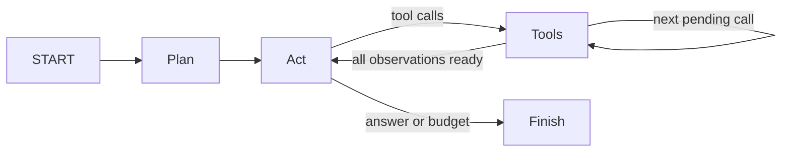

# V2: 状态与恢复

V1 的 Python 循环在进程退出后丢失全部工作记忆。V2 使用 LangGraph 显式图和 SQLite checkpoint。



- Context：本次送给模型的消息子集。
- State：messages、计划、待执行工具、游标和预算计数。
- Thread：一个任务的持久身份；不同 thread 互不混用状态。
- Checkpoint：某个节点完成后的状态快照；由 SQLite 保存，不是长期知识库。
- Resume：新进程从最新 checkpoint 的下一节点继续，不重新制定计划。

每个 Tools 节点只执行一个工具，使多个 tool calls 之间也能保存进度。
计划使用一次单独模型调用，并计入步数和 token 预算。token 上限是软上限，依赖提供商 usage；
单次请求可能超过剩余额度。工具调用次数是硬预算。无 usage 的提供商不能提供可靠 token 预算。

## 运行

```bash
forgecode --repo /path/to/repo --thread demo --pause-after-tool '修复测试失败'
forgecode --repo /path/to/repo --thread demo --resume
```

`--no-planning` 可关闭计划；`--max-steps`、`--max-calls`、`--max-tokens` 在任务创建时保存。
恢复时可以更换模型和接口，但不会重置预算或改变目标目录。

## 恢复边界

checkpoint 不能让文件修改与数据库提交成为同一个原子事务。
如果进程恰好在工具产生副作用后、checkpoint 写入前被杀死，该工具可能重放。
唯一文本替换通常会返回匹配失败供模型观察，但任意 shell 命令可能不幂等。
本项目不声称 exactly-once，也不支持同一 thread 的多进程并发写入。

## 验证

`tests/test_v2.py` 检查关闭并重新打开数据库后恢复、工具不重复执行、预算终止。
`scripts/validate_state.py` 用两个独立进程运行真实模型任务：第一个工具后退出，再在新进程恢复并独立验收测试。

2026-09-21 验证通过：累计 12 个自动化测试通过（新增 3 个状态测试）；真实任务在 calls=1 时暂停，
关闭进程后恢复至 calls=6、status=answered，图无待执行节点。独立运行 2 个测试全部通过，测试文件未改动。
